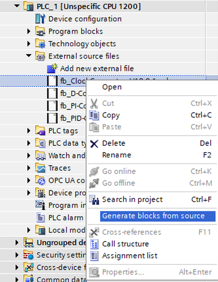

# PID controller for Siemens SCL Tia-Portal

## Problem
I always had a lot to do with control technology at the Tia Portal and was simply never satisfied with the Siemens modules. I need PI controllers for pressure control and PID for temperature control. Here are a few points that bothered me:
- Different devices among different CPUs use deferent lib.
- Cannot be simulated.
- Not posible to read the source and change it.
- Far too complicated with a high level of familiarisation.
- No portability to Codesys.
- Too high integration in TIA.
- Do a lot of tinkering and testing until finally something worked.
- Cyclic OBs and Global DB were absolutely necessary. You can not integrate it in your privat functions.
- Many thousands of pages of manuals.

## Work
After an extensive search, I couldn't find an alternative solution. However, taking OSCAT as inspiration, which is quite straightforward, I've rewritten the functions in TIA14 and 15 for the 1200 and 1500 CPUs. I continue to use this control in my Tia Portal 18 projects. My goal wasn't to please everyone but to give something back. I've gained valuable knowledge through open libraries like OSCAT, and it's only fair that I share my work. 
Please refrain from debating the functions; they work as intended. Feel free to copy and use them. If you'd like, share your experiences with my software with others.

## Using instruction
The controller produce a outputs from 0 to 100. If used with a binary actor you shoud use the clock generator for pulse width modulation. The PI controller are disigned to run alone. Usefull for pressure regulation. The PID controller is a combination of PI and D controller. Usefull for temperature regulation. The controller should alwasys stoped with the reset input if the regulation loop is disturbed. This prevents the integral to windup. 

- ir_Input = The mesuered value of pressure or themperature
- ir_Setpoint = The demanded value of pressure or themperature
- ir_ProportionalGain = The proportional gain, a tuning parameter
- ir_IntegrationGain = The integral gain, a tuning parameter
- ir_DifferentialGain = The derivative gain, a tuning parameter
- itime_DifferezialActionTime = The length of the derivative action, a tuning parameter
- ib_Reset = Empty the integral and sets the output to zero
- or_Output = Output value in % from 0 to 100


## Installing
Installing is quite simple. Insert the two SLC files under "External source files" and then execute the menu item "Generate blocks from source".



## Porting
Code is very easy:
...
// Proportional
#Controller_Response_Proportional := #ir_ProportionalGain * (#ir_Setpoint - #ir_Input);
// Intergal
#Controller_Response_Integral += #ir_IntegrationGain * (#ir_Setpoint - #ir_Input) * #PastTime;
// Differential
#Intermediate_value += (#ir_SetpointDiverence - #Intermediate_value) * #PastTime / #HoldingTime;
#or_Output := (#ir_SetpointDiverence - #Intermediate_value) * #ir_DifferentialGain ;
```
The rest is just preventig the interal to windup aud check the Cycle time is valid.

Note on porting to Step-7, Codesys or similar:
...
#PastTime := LREAL_TO_REAL(RUNTIME(#StaticCycleTime_Aux));
IF #PastTime > 0 AND #PastTime < 0.1 THEN
```    
The first line returns the time between two calls in seconds. The resolution is accurate to the nanosecond. The second one checks the validity. With Step-7 I would pass the time as parameter, with Codesys TIME_TCK can be used. On 300 PLC it might be possible to work with "SFC64"(TIMETICK). 

## License
This project is released under the WTFPL LICENSE.
<a href="http://www.wtfpl.net/"></a>
